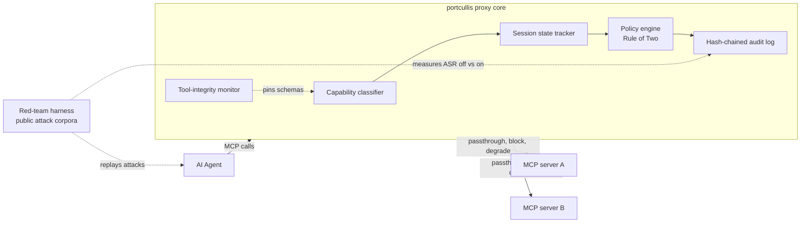

# portcullis

The gate that drops.

Prompt injection is architecturally unsolved. OWASP reports attacks up roughly 340% year over year
as of mid-2026, and every serious defense converges on the same idea, Simon Willison's "lethal
trifecta" and Meta's Rule of Two: an agent must never simultaneously hold private-data access,
untrusted-content exposure, and an egress path. Today that rule is enforced by architecture review
and hope. portcullis is an MCP-first reverse proxy that turns the Rule of Two into a runtime policy
object. It classifies tool capabilities, tracks which trifecta legs are armed per session, and
blocks, flags, or degrades the call that would complete the triangle, with a hash-chained audit log
behind every decision.

## Status

Early stage. The design is complete and implementation proceeds milestone by milestone (see
Roadmap). The current focus is an MCP passthrough proxy with structured audit events.

## Scope and honesty

portcullis is defense in depth, not a fix. Prompt injection is not solved, and adaptive attackers
defeat most published defenses; the goal is to reduce attack success rate and to measure the
reduction, not to claim immunity. Results are reported as attack-success-rate per attack class
alongside a false-positive rate on benign sessions, never as a single blended number. The
audit-log schema is informed by EU AI Act record-keeping themes; it is not a compliance
certification.

## Architecture



## Why this exists

- Prompt injection has no fix, only mitigations, and the problem is worsening rather than solved
  ([OWASP coverage, 2026](https://www.helpnetsecurity.com/2026/06/11/owasp-prompt-injection-ai-security-failures/)).
- No widely adopted tool enforces the Rule of Two at runtime; it is a known analytical framework
  enforced today only by manual design review.
- The MCP ecosystem it protects is measurably unsafe: 41% of public servers have zero
  authentication, only 8.5% use OAuth, and 5 of 7 popular clients do no static validation of tool
  metadata
  ([MCP security statistics, 2026](https://www.practical-devsecops.com/mcp-security-statistics-2026-report/)).
- Governance, not model quality, blocks enterprise agent adoption; Gartner expects more than 40% of
  agentic AI projects to be scrapped by 2027 over this gap
  ([Gartner, 2026](https://www.gartner.com/en/newsroom/press-releases/2026-05-26-gartner-says-applying-uniform-governance-across-ai-agents-will-lead-to-enterprise-ai-agent-failure)).

## What the first release delivers

An MCP-protocol-aware reverse proxy that agents connect to instead of raw MCP servers: passthrough
by default, with policy hooks on every tool listing and tool call, static capability classification
of tools into private-data, untrusted-content, and egress, a per-session ledger of which trifecta
legs are armed, and a versioned-YAML policy engine that can block, flag, degrade, or require human
approval on the call that would complete the triangle, all recorded to a hash-chained audit log.

## Roadmap

1. MCP passthrough proxy with structured audit events.
2. Capability classifier and versioned-YAML policy objects.
3. Session state tracker and live Rule-of-Two enforcement.
4. Red-team harness against public attack corpora, reporting attack success rate with enforcement
   off and on.
5. Tool-integrity monitor with schema hash pinning.
6. Hash-chained audit log with governance-oriented export.
7. Per-agent RBAC and budgets.

## Development

```bash
uv sync
make check   # lint, typecheck, test
```

## License

Apache-2.0. See [LICENSE](LICENSE).
